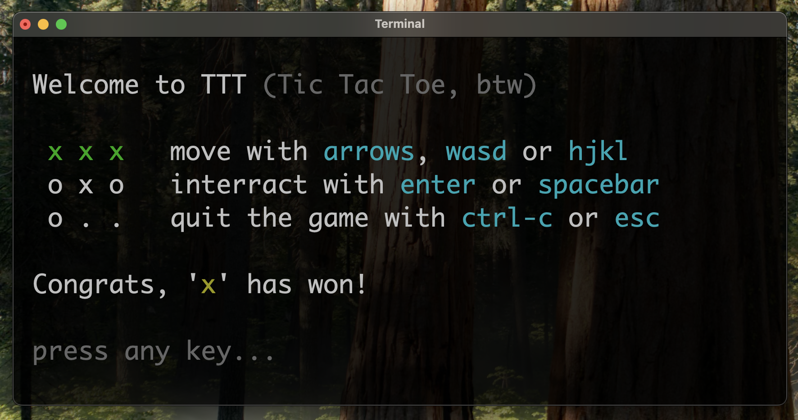

<div style="text-align: center">
<h1>TTT</h1>
Simple Tic Tac Toe game written in C
</div>

## Build & Run
To build and run ASAP, do:
```shell
source ./scripts/build-tui.sh
./ttt
```

There are 2 versions of game UI:
1. TUI (default)
2. CLI

If you want to build with CLI or TUI explicitly
```shell
# build with CLI
source ./scripts/build-cli.sh

# build with TUI
source ./scripts/build-tui.sh

# run
./ttt
```